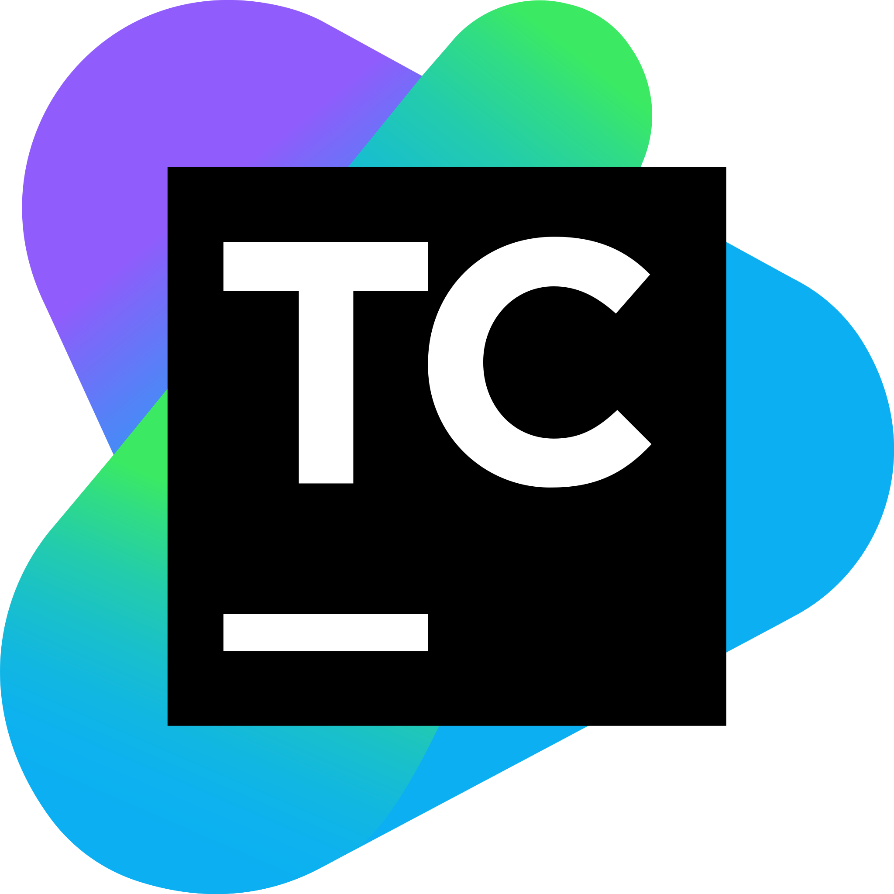

# Всем привет! Меня зовут Евгений 👋  

Я являюсь специалистом по автоматизации тестирования на Java и JavaScript! А так же успешно выполняю роль TeamLead, отвечая за планирование, распределение ресурсов и соблюдение сроков на государственном проекте ГосУслуги </a> </a>  Мой опыт работы подтвержденный по ТК РФ — 6 лет.
 
 
> Коммерческий опыт. Проекты для которых я разрабатывал автоматизацию тестирования:
> 
 - **SBER** 
 - **Сitilink.ru** 
 - **ГосУслуги** 
 - **ОТП Банк** 

<a href="https://t.me/palmeka" target="_blank">Я всегда на связи в Telegram</a> 

## Мой стек технологий

  
  
  
  
  
  
  
  
  
 
 
 
  
  
 
  
  
> - **IntelliJ IDEA**: Среда разработки для написания кода.
> - **Java**: Язык программирования проекта.
> - **JavaScript**: Язык программирования проекта.
> - **GitHub**: Платформа для хостинга и совместной разработки кода.
> - **JUnit 5**: Фреймворк для написания и выполнения тестов.
> - **Gradle**: Система сборки проектов.
> - **Selenide**: Библиотека для написания UI тестов.
> - **Selenoid**: Инструмент для управления браузерами в контейнерах.
> - **REST Assured**: Библиотека для написания API тестов.
> - **Allure**: Фреймворк для генерации отчетов о тестировании.
> - **Jenkins**: Инструмент для автоматизации сборки и CI/CD.
> - **TeamCity**: Инструмент для автоматизации сборки и CI/CD.
> - **Telegram**: Умею настраивать интеграцию для автоматической рассылки уведомлений о сборке проекта.
> - **Jira**: Платформа для управления проектами и отслеживания задач.
> - **Allure TestOps**: Платформа для управления тестированием и анализа результатов тестов.
> - **Playwright**: Библиотека для написания UI тестов и API.
## **Примеры моих работ:**

* <a href="https://github.com/jekkka23/citilink.ru" target="_blank">Проект в котором я использую весь стек технологий</a>

* [Пример сборки в Jenkins](https://github.com/jekkka23/citilink.ru/tree/main?tab=readme-ov-file#%D1%81%D0%B1%D0%BE%D1%80%D0%BA%D0%B0-%D0%B2-jenkins)

* [Пример Allure отчетов](https://github.com/jekkka23/citilink.ru/tree/main?tab=readme-ov-file#-allure-%D0%BE%D1%82%D1%87%D0%B5%D1%82)

* [Пример уведомлений ботом в Telegram о сборке](https://github.com/jekkka23/citilink.ru/tree/main?tab=readme-ov-file#-allure-%D0%BE%D1%82%D1%87%D0%B5%D1%82)

* [Пример автоматической записи видео выполнения теста в Selenoid](https://github.com/jekkka23/citilink.ru/tree/main?tab=readme-ov-file#-allure-%D0%BE%D1%82%D1%87%D0%B5%D1%82)

